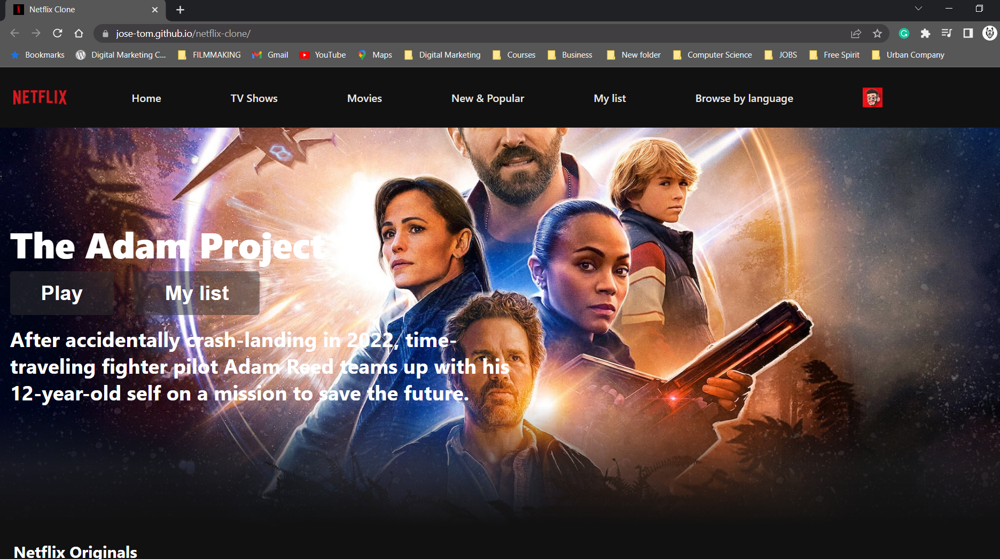
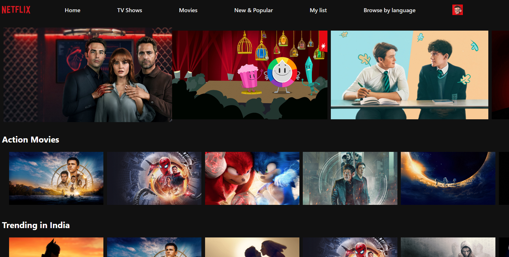
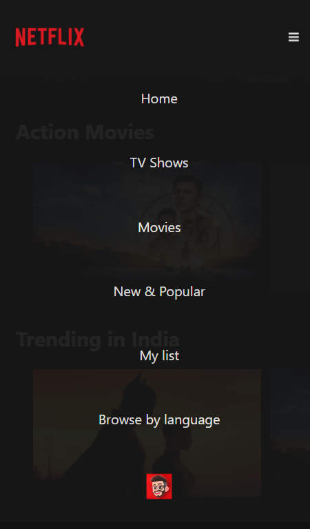
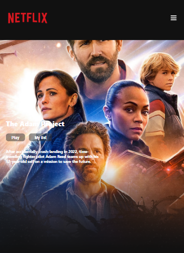

# Netflix-clone

I have built this project to understand the basics of React and implement concepts such as State and Hooks. I have used TMDB to get dynamic data and Axios as the Http client.    
    
    
 

